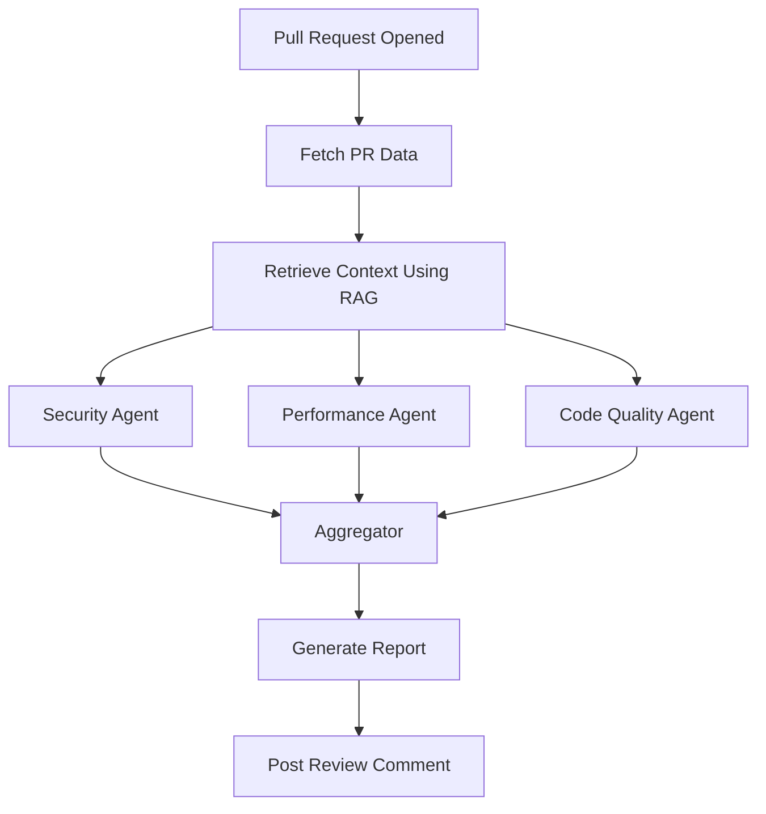

# 🚀 Autonomous GitHub Code Review Agent

<p align="center">


</p>

<p align="center">
An AI-powered GitHub Pull Request Review System that combines <b>Claude Sonnet</b>, <b>LangGraph</b>, <b>RAG</b>, and <b>GitHub Automation</b> to deliver intelligent code reviews with repository-wide context.
</p>

---

## ✨ Overview

Manual code reviews are time-consuming and often inconsistent.

This project automatically:

✅ Detects new Pull Requests

✅ Retrieves changed files and repository context

✅ Performs Security Analysis

✅ Detects Performance Bottlenecks

✅ Reviews Code Quality & Maintainability

✅ Generates AI-powered Suggestions

✅ Posts Structured Feedback directly on GitHub

The system leverages Repository-Aware RAG and Claude Sonnet to review code using the context of the entire codebase rather than just the changed files.

---

# 🏗 Architecture

```text
Developer Creates PR
        │
        ▼
GitHub Webhook
        │
        ▼
FastAPI Backend
        │
        ▼
GitHub API Client
        │
        ▼
Repository-Aware RAG
(ChromaDB + Embeddings)
        │
        ▼
LangGraph Workflow
        │
 ┌──────┼────────┐
 ▼      ▼        ▼
Security  Performance  Quality
 Agent      Agent      Agent
        │
        ▼
 Aggregator Agent
        │
        ▼
 Claude Sonnet
        │
        ▼
 GitHub Review Comment
```

---

# 🎯 Key Features

| Feature               | Description                              |
| --------------------- | ---------------------------------------- |
| GitHub Webhooks       | Automatically listens for PR events      |
| Claude Sonnet Reviews | AI-powered code analysis                 |
| Repository-Aware RAG  | Understands existing code patterns       |
| Multi-Agent System    | Security, Performance, Quality reviewers |
| Automated PR Feedback | Posts comments directly to GitHub        |
| Code Quality Score    | Generates a 0–100 review score           |
| Suggested Fixes       | Actionable improvement recommendations   |
| MCP Tools             | Dynamic tool calling architecture        |
| Docker Deployment     | Production-ready containerization        |
| Railway Support       | One-click cloud deployment               |

---

# 🧠 AI Agent Workflow



---

# 🔍 Example AI Review

## Input

```python
password = "admin123"

query = f"SELECT * FROM users WHERE id={user_id}"
```

## Output

```markdown
# AI Review Report

Overall Score: 71/100

## Security

❌ Hardcoded credential detected

❌ Potential SQL Injection vulnerability

## Suggested Fixes

Use environment variables for secrets.

Use parameterized database queries.
```

---

# 🛠 Tech Stack

## Backend

* Python 3.12
* FastAPI
* Pydantic

## AI & Agents

* Claude Sonnet
* LangGraph
* MCP

## RAG

* ChromaDB
* Sentence Transformers
* all-MiniLM-L6-v2

## GitHub Integration

* GitHub REST API
* GitHub Webhooks
* PyGithub

## Deployment

* Docker
* Docker Compose
* Railway

---

# 📂 Project Structure

```text
github-review-agent/

app/
agents/
rag/
graph/
mcp/
prompts/
tests/

Dockerfile
docker-compose.yml
README.md
requirements.txt
```

---

# 🚀 Quick Start

```bash
git clone <repo-url>

cd github-review-agent

python -m venv .venv

source .venv/bin/activate

pip install -r requirements.txt

cp .env.example .env

uvicorn app.main:app --reload
```

---

# 📊 Sample Review Score

| Category        | Score |
| --------------- | ----- |
| Security        | 92    |
| Performance     | 88    |
| Maintainability | 90    |
| Overall         | 90    |

---

# 🧪 Testing

```bash
pytest
```

---

# 📸 Demo Screenshots

Add screenshots here:

* GitHub PR Comment
* FastAPI Swagger Docs
* ChromaDB Indexing Logs
* Railway Deployment

---

# 🌟 Future Enhancements

* AI-generated Pull Request Summaries
* Automatic Code Fixes
* Slack Notifications
* GitHub Actions Integration
* Multi-Repository Support
* Self-Healing Code Suggestions

---

# 👨‍💻 Why This Project Matters

This project demonstrates production-grade experience with:

* Agentic AI
* Retrieval-Augmented Generation (RAG)
* LangGraph Workflows
* MCP Tool Calling
* Claude Sonnet
* GitHub Automation
* Vector Databases
* Cloud Deployment

It is designed as an AI Engineering portfolio project showcasing modern LLM application architecture.

---

# 📄 License

MIT License

---

⭐ If you found this project useful, consider starring the repository.
